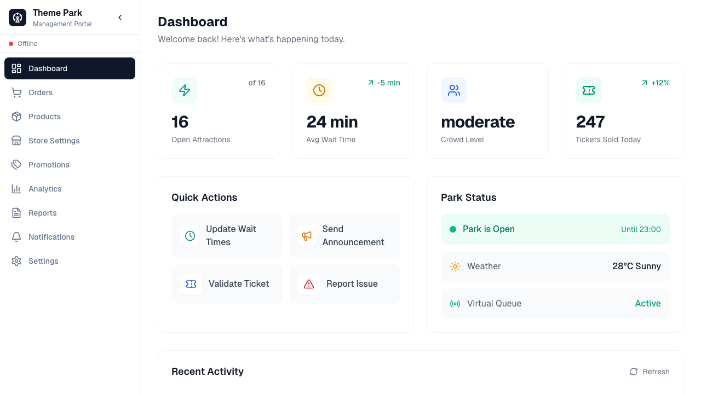
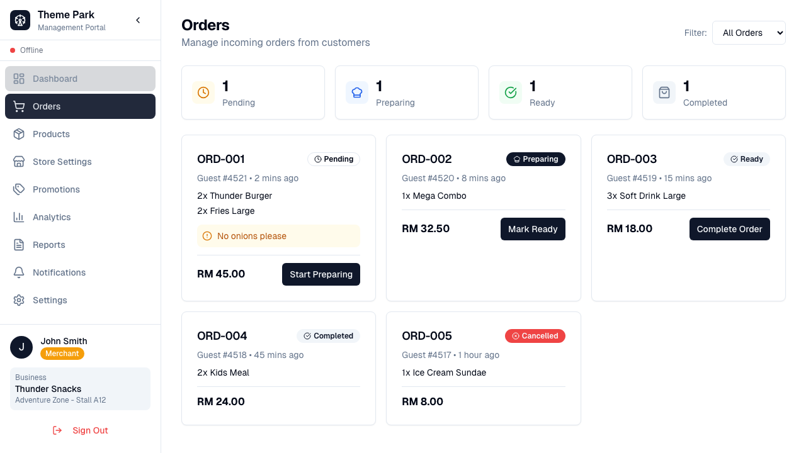
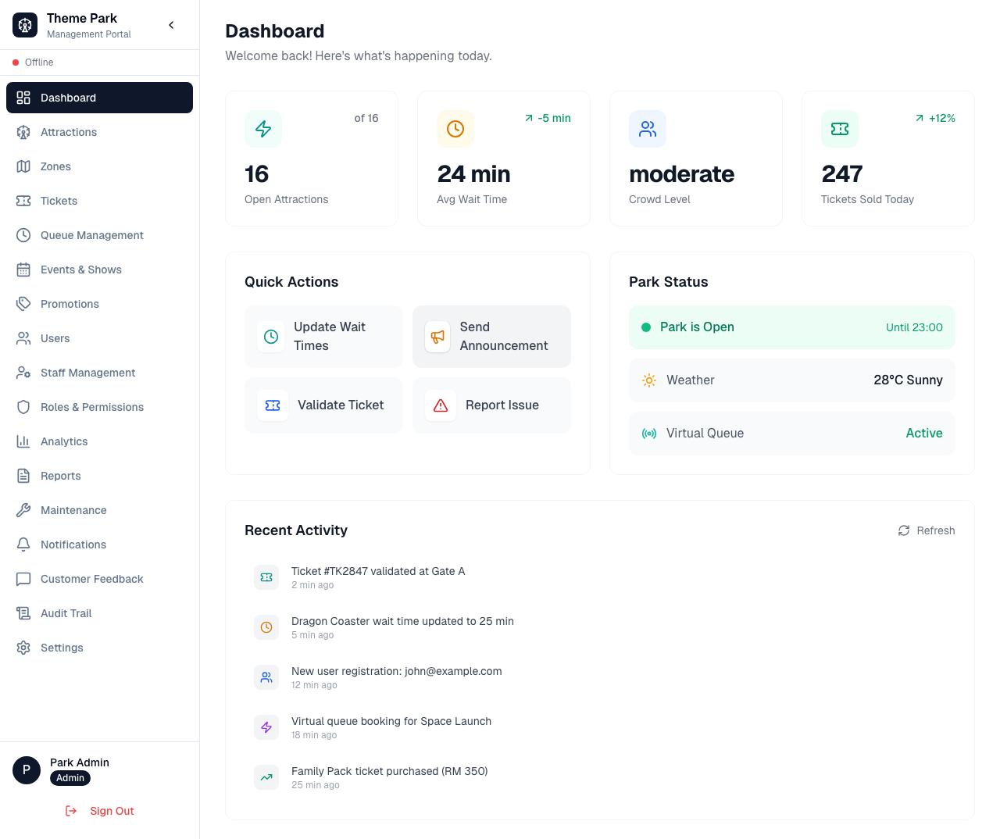

# Theme Park Management Portal

A unified admin and merchant portal for theme park management with role-based access control.

## Live Demo

**Local URL:** http://localhost:8086

### Demo Accounts

| Role | Email | Password |
|------|-------|----------|
| Admin | admin@themepark.com | admin123 |
| Merchant | merchant@themepark.com | merchant123 |
| Staff | staff@themepark.com | staff123 |

## Features

### Admin Dashboard
- **Attractions Management** - Add, edit, and monitor all theme park attractions
- **Zones Management** - Organize the park into themed zones
- **Ticket Management** - Configure ticket types, pricing, and availability
- **User Management** - Manage staff and customer accounts
- **Staff Management** - Assign roles and schedules
- **Roles & Permissions** - Configure RBAC for the system
- **Audit Trail** - Track all system changes
- **Queue Management** - Monitor and manage virtual queues
- **Events & Promotions** - Create and manage park events
- **Analytics & Reports** - View park performance metrics

### Merchant Dashboard
- **Orders Management** - Real-time order tracking with status updates
- **Products Management** - Menu/inventory with availability toggles
- **Store Settings** - Business information and operating hours
- **Promotions** - Create merchant-specific deals
- **Analytics** - Sales and performance insights

### Shared Features
- **Real-time Dashboard** - Live park stats, weather, crowd levels
- **Notifications** - System-wide notification center
- **Settings** - Account and preferences

## Tech Stack

- **Frontend:** React 19 + TypeScript
- **Build Tool:** Vite 6
- **UI Components:** shadcn/ui (new-york theme)
- **Styling:** Tailwind CSS v4
- **Icons:** Lucide React
- **Routing:** React Router DOM v6

## Getting Started

### Prerequisites
- Node.js 18+
- npm or yarn

### Installation

```bash
# Clone the repository
git clone <repo-url>
cd themepark-portal

# Install dependencies
npm install

# Start development server
npm run dev
```

The app will be available at http://localhost:8086

### Build for Production

```bash
npm run build
```

### Run Tests

```bash
# Run E2E tests
npx playwright test

# Run specific test file
npx playwright test tests/comprehensive-portal.spec.ts
```

## Project Structure

```
src/
├── components/
│   ├── ui/           # shadcn components (Button, Card, Badge, etc.)
│   └── Layout.tsx    # Main layout with role-based sidebar
├── context/
│   └── AuthContext.tsx   # Authentication with role support
├── pages/
│   ├── LoginPage.tsx         # Unified login with demo accounts
│   ├── DashboardPage.tsx     # Role-aware dashboard
│   ├── OrdersPage.tsx        # Merchant: Order management
│   ├── ProductsPage.tsx      # Merchant: Product management
│   ├── StoreSettingsPage.tsx # Merchant: Store configuration
│   ├── AttractionsPage.tsx   # Admin: Attraction management
│   ├── ZonesPage.tsx         # Admin: Zone management
│   └── ...                   # Additional pages
├── lib/
│   └── utils.ts      # Utility functions (cn)
└── main.tsx          # App entry with routing
```

## Role-Based Access Control

The portal implements role-based navigation and route protection:

| Route | Admin | Merchant | Staff |
|-------|-------|----------|-------|
| Dashboard | Yes | Yes | Yes |
| Orders | No | Yes | No |
| Products | No | Yes | No |
| Store Settings | No | Yes | No |
| Attractions | Yes | No | No |
| Zones | Yes | No | No |
| Users | Yes | No | No |
| Audit Trail | Yes | No | No |
| Analytics | Yes | Yes | Yes |
| Settings | Yes | Yes | Yes |

## Screenshots

### Merchant Dashboard


### Orders Page


### Admin Dashboard


## Deployment

### Vercel (Recommended)

1. Push code to GitHub
2. Connect repository to Vercel
3. Configure build settings:
   - Framework: Vite
   - Build Command: `npm run build`
   - Output Directory: `dist`
4. Deploy

### Manual Deployment

```bash
# Build the project
npm run build

# The dist/ folder contains static files
# Serve with any static file server
npx serve dist
```

## Environment Variables

Currently, the app uses demo data and doesn't require environment variables.

For production, you would add:
```env
VITE_API_URL=https://your-api.com
VITE_WS_URL=wss://your-websocket.com
```

## Test Results

E2E tests cover:
- Login page rendering and validation
- Role-based authentication (Admin, Merchant, Staff)
- Navigation visibility based on role
- Page access control
- Order management workflow
- Product management
- Mobile responsiveness
- Protected route redirects

**Latest Results:** 18/23 tests passing

## Contributing

1. Fork the repository
2. Create your feature branch (`git checkout -b feature/AmazingFeature`)
3. Commit your changes (`git commit -m 'Add some AmazingFeature'`)
4. Push to the branch (`git push origin feature/AmazingFeature`)
5. Open a Pull Request

## License

MIT License - feel free to use this project however you like.

---

Built with React, TypeScript, and shadcn/ui.
